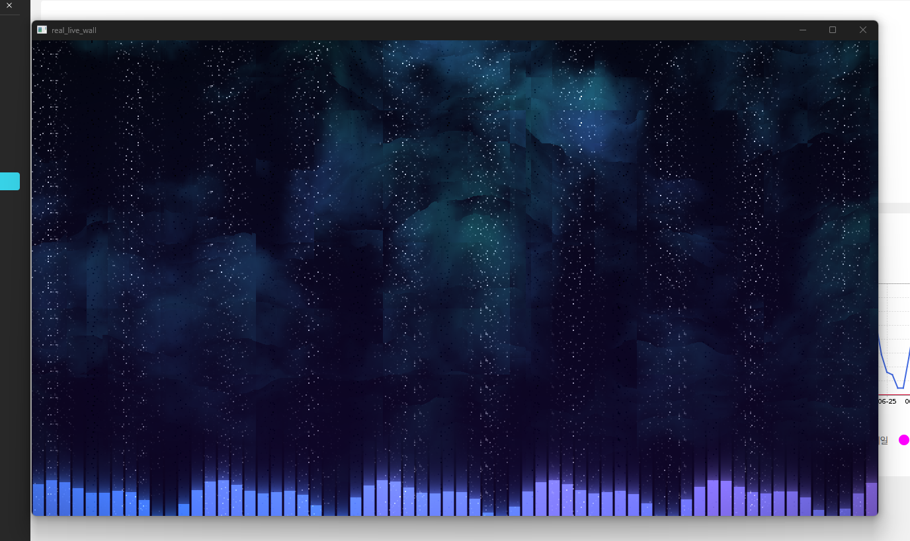
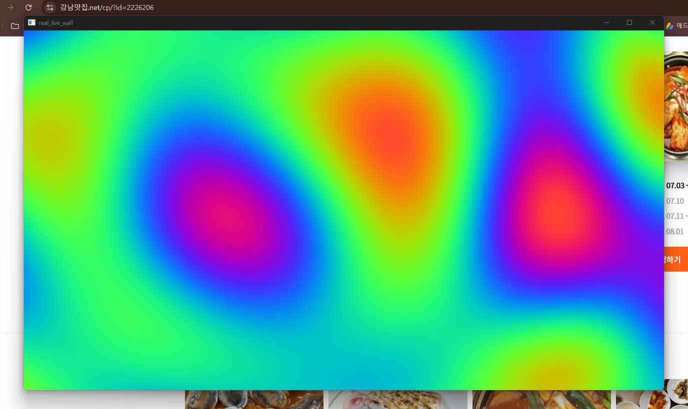

# real_live_wall

> **리액티브 · 크로스플랫폼 라이브 월페이퍼 엔진** — GPU 네이티브(wgpu),
> Shadertoy GLSL 호환, 실시간 오디오/시스템 반응.

시중의 라이브 월페이퍼는 대부분 "영상·웹페이지를 배경에 트는 재생기"다.
`real_live_wall`은 다르다. **바탕화면이 지금 내 컴퓨터의 상태 — 재생 중인 음악의
스펙트럼, CPU/메모리 부하, 시간 — 에 실시간으로 반응**하고, **Shadertoy의 GLSL
셰이더를 거의 그대로** 돌린다. 그리고 Windows/macOS/Linux를 **하나의 셰이더 포맷**으로
겨냥한다.

## ✨ 차별점

| | Wallpaper Engine | Lively | **real_live_wall** |
|---|:---:|:---:|:---:|
| 크로스플랫폼 | ❌ Windows | ❌ Windows | ✅ Win/Mac/Linux(진행 중) |
| GPU 네이티브 (Vulkan/DX12/Metal) | 부분 | ❌(브라우저) | ✅ wgpu |
| 오디오 반응(FFT) | 제한적 | ❌ | ✅ 64-bin 스펙트럼 + bass/mid/treble |
| 시스템 반응(CPU/메모리) | ❌ | ❌ | ✅ |
| Shadertoy 셰이더 호환 | ❌ | ❌ | ✅ `mainImage()` 그대로 |
| 오픈소스 | ❌ | ✅ | ✅ |

## 🖼️ 스크린샷

**기본 씬** — 오디오 반응형 오로라 + 64밴드 스펙트럼 이퀄라이저 (WGSL, preview 모드)



**Shadertoy GLSL** — `shaders/plasma.glsl`을 수정 없이 로드 (naga GLSL 프론트엔드)



> 실측 환경: Windows 11 · NVIDIA RTX 3060 · Vulkan 백엔드.

## 🚀 빠른 시작

필요: [Rust](https://rustup.rs) (stable), 그리고 Vulkan/DX12/Metal 지원 GPU.

```bash
# 개발용 미리보기 창 (기본 오로라 씬)
cargo run --release

# Shadertoy 스타일 GLSL 씬 로드 + 파일 변경 시 핫리로드
cargo run --release -- --shader shaders/audio_bars.glsl --watch

# 실제 데스크톱 월페이퍼로 (Windows)
cargo run --release -- --mode wallpaper --shader shaders/plasma.glsl
```

`Esc`(preview 모드) 로 종료.

## ⚙️ CLI 옵션

| 옵션 | 기본값 | 설명 |
|---|---|---|
| `--mode <preview\|wallpaper>` | `preview` | 미리보기 창 / 실제 바탕화면 |
| `--shader <path>`, `-s` | (기본 WGSL 씬) | Shadertoy GLSL 파일 |
| `--audio <auto\|input\|loopback\|off>` | `auto` | 오디오 소스 (Windows는 auto=루프백) |
| `--gain <f32>` | `6.0` | 오디오 감도 |
| `--watch` | `false` | 셰이더 파일 핫리로드 |
| `--width`/`--height` | `1280`/`720` | preview 창 크기 |

## 🎨 셰이더 작성 (Shadertoy 호환)

Shadertoy와 동일하게 `mainImage`만 정의하면 된다:

```glsl
void mainImage(out vec4 fragColor, in vec2 fragCoord) {
    vec2 uv = fragCoord / iResolution.xy;
    fragColor = vec4(uv, 0.5 + 0.5 * sin(iTime), 1.0);
}
```

지원 uniform(표준): `iResolution`, `iTime`, `iTimeDelta`, `iFrame`, `iMouse`,
`iDate`, `iSampleRate`, `iFrameRate`.

**엔진 확장**(리액티브 월페이퍼용):

| 이름 | 의미 |
|---|---|
| `float iBass / iMid / iTreble / iVolume` | 오디오 밴드 에너지 (0..1) |
| `float iSpectrum(float x)` | `x`(0..1) 위치의 FFT 스펙트럼 |
| `float iCpu / iMem` | CPU·메모리 부하 (0..1) |

예제: [`shaders/plasma.glsl`](shaders/plasma.glsl)(순수 Shadertoy),
[`shaders/audio_bars.glsl`](shaders/audio_bars.glsl)(오디오 반응).

## 🧭 아키텍처

풀스크린 셰이더 1패스 + 세 언어(Rust/WGSL/GLSL) 공유 uniform 계약.
자세한 내용은 [`docs/ARCHITECTURE.md`](docs/ARCHITECTURE.md).

## 🗺️ 로드맵

- [ ] macOS/Linux 월페이퍼 표면 구현
- [ ] 멀티모니터 개별 씬
- [ ] Shadertoy `iChannel0` 오디오 텍스처 완전 호환
- [ ] 멀티패스(버퍼) 셰이더
- [ ] 날씨/캘린더 리액티브 소스
- [ ] 전체화면·배터리 감지 자동 일시정지
- [ ] 씬 매니페스트(JSON) + 갤러리

## 📄 라이선스

MIT OR Apache-2.0
