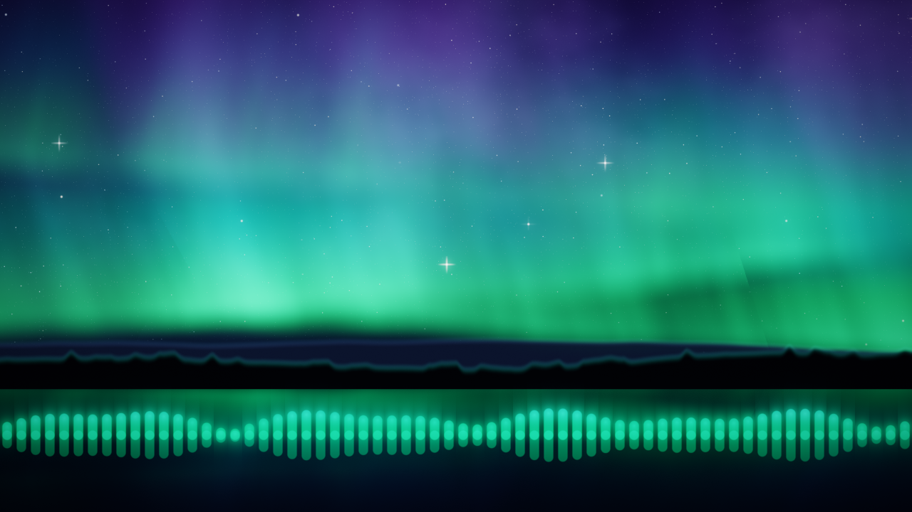
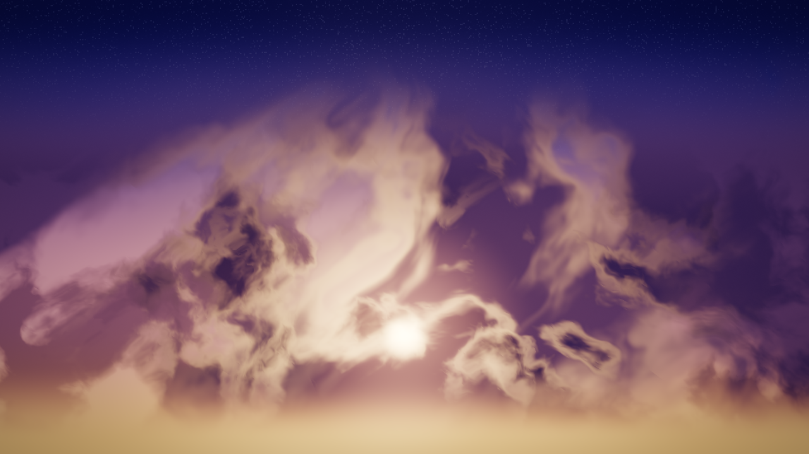
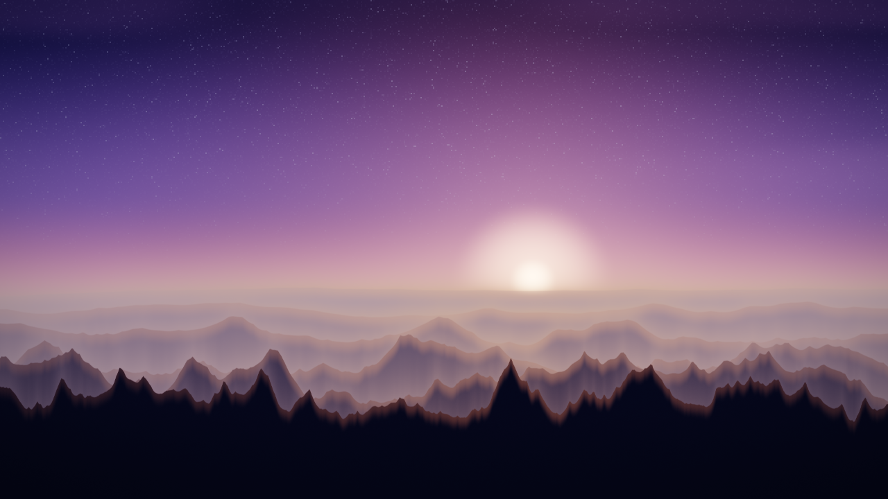
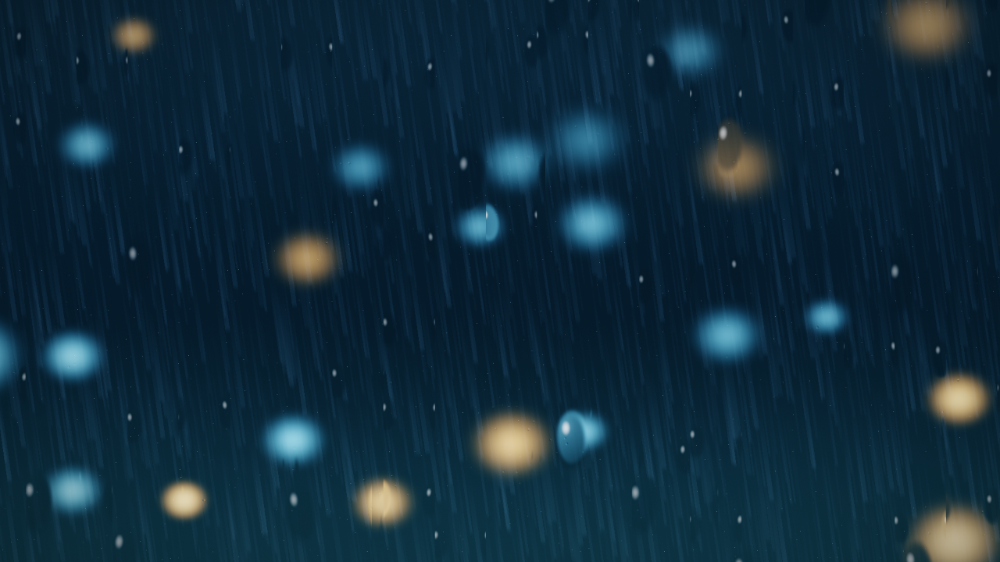
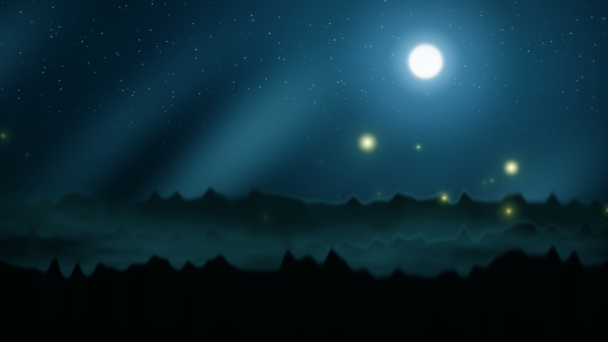
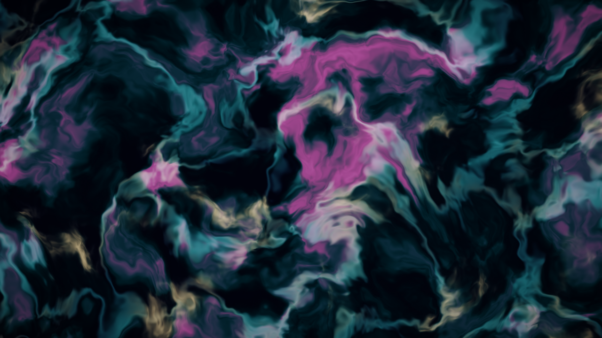
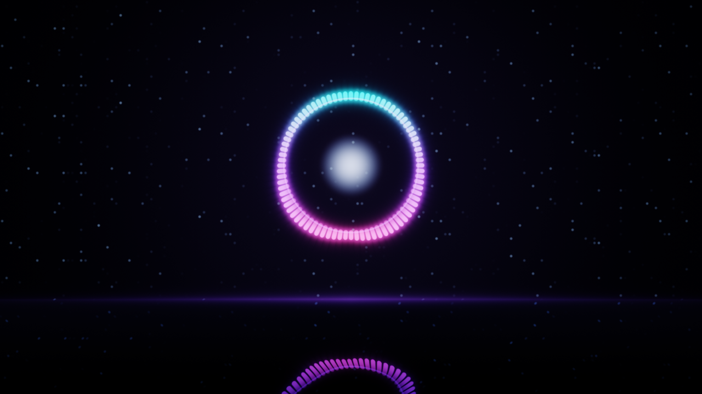

# real_live_wall

> **리액티브 · 크로스플랫폼 라이브 월페이퍼 엔진** — GPU 네이티브(wgpu),
> Shadertoy GLSL 호환, 실시간 오디오/시스템 반응.

시중의 라이브 월페이퍼는 대부분 "영상·웹페이지를 배경에 트는 재생기"다.
`real_live_wall`은 다르다. **바탕화면이 지금 내 컴퓨터의 상태 — 재생 중인 음악의
스펙트럼, CPU/메모리 부하, 시간 — 에 실시간으로 반응**하고, **Shadertoy의 GLSL
셰이더를 거의 그대로** 돌린다. 그리고 Windows/macOS/Linux를 **하나의 셰이더 포맷**으로
겨냥한다. 모든 씬은 **HDR 블룸 · ACES 톤매핑 · 슈퍼샘플 AA**를 거쳐 시네마틱하게 출력된다.

## ✨ 차별점

| | Wallpaper Engine | Lively | **real_live_wall** |
|---|:---:|:---:|:---:|
| 크로스플랫폼 | ❌ Windows | ❌ Windows | ✅ Win/Mac/Linux(진행 중) |
| GPU 네이티브 (Vulkan/DX12/Metal) | 부분 | ❌(브라우저) | ✅ wgpu |
| 오디오 반응(FFT) | 제한적 | ❌ | ✅ 64-bin 스펙트럼 + bass/mid/treble |
| 시스템 반응(CPU/메모리) | ❌ | ❌ | ✅ |
| Shadertoy 셰이더 호환 | ❌ | ❌ | ✅ `mainImage()` 그대로 |
| HDR 블룸·톤매핑·AA | ✅ | ❌ | ✅ 시네마틱 포스트FX |
| 멀티모니터 | ✅ | ✅ | ✅ 모니터마다 전체 장면 개별 렌더 |
| 설정 GUI | ✅ | 일부 | ✅ egui 패널(F1) |
| 오픈소스 | ❌ | ✅ | ✅ |

## 🖼️ 스크린샷

**설정 GUI (egui)** — 씬/셰이더 선택, 오디오 소스·게인, 실시간 미터(FPS·CPU·오디오),
**"바탕화면에 적용"**, **"로그인 시 자동 시작"** 체크박스. 설정은 자동 저장되어 다음
실행 때 복원됩니다. `F1`로 패널을 숨기면 순수 배경만 남습니다.


패널 전체(씬 갤러리 + 오디오/재생 곡/시스템 카드)는 [`docs/screenshots/gui-full.png`](docs/screenshots/gui-full.png) 참고.

> 실측 환경: Windows 11 · NVIDIA RTX 3060 · Vulkan 백엔드 · 4모니터 동시 부착.

## 🆕 v1.2 — 리액티브 스프린트

이번 릴리즈는 차별화 3축 중 **1번(리액티브 데이터)**을 가장 깊게 판 릴리즈입니다.

- **🎵 재생 곡(Now Playing) 앨범아트 팔레트** *(킬러 기능)* — Windows SMTC로 지금
  재생 중인 곡의 제목·아티스트·앨범아트를 읽고, 앨범아트에서 대표색 4개를 추출해
  셰이더로 흘려보냅니다. 기본 오로라 씬은 음악이 재생되면 그 앨범의 색으로 물들고
  비트에 맞춰 펄스합니다. Spotify든 유튜브뮤직이든 틀기만 하면 배경이 반응 — Wallpaper
  Engine에도 없는 "살아있음"입니다.
- **🥁 비트/BPM 싱크** — 스펙트럴 플럭스 온셋 검출 + 자기상관 템포 추정으로 곡의
  박자에 맞춰 씬이 반응합니다. 설정 패널에 실시간 "♩ NN BPM · 비트 감지" 표시.
- **⏸️ 자동 일시정지** — 전체화면 게임/영상이 포그라운드이거나 노트북이 배터리로
  구동될 때 렌더를 멈춰 GPU·전력을 아낍니다. "초저부하 & 매너" 원칙의 핵심 안전장치.
- **🖼️ 씬 썸네일 갤러리** — 텍스트 드롭다운 대신 8개 씬을 2열 썸네일 그리드로
  골라 쓸 수 있습니다.
- **🔁 재생목록 자동 순환** — N분마다(셔플 옵션 포함) 씬을 자동으로 바꿔주는
  "설정하고 잊는" 모드.
- **⬆️ 자동 업데이트** — 실행 시 GitHub 최신 릴리즈를 조회해 새 버전이 있으면 설정
  패널에 배너로 알리고, 클릭 한 번으로 다운로드·설치·재시작합니다.
- **🎨 설정 GUI 전면 고도화** — 딥 네이비 반투명 패널 + 오로라틸 액센트 + 카드형
  레이아웃으로 다시 디자인했습니다.

## 🎬 씬 갤러리 (v1.1 판매급 리마스터)

기본 제공 씬 8종 전부 이번 릴리즈에서 전면 리워크했습니다. 일부 GPU에서 화면 전체에
사각 블록 아티팩트를 일으키던 fp32 sin 정밀도 붕괴 버그(해시 함수 재작성)를 근본
해결하고, HDR 노출 예산과 아트를 씬마다 다시 잡았습니다.

| | |
|---|---|
| **기본 (오로라)** — 3겹 물결 커튼·세로 광선, 은하수, 3층 별(회절 스파이크), 산 실루엣 + 호수 반영, 라운드캡 EQ |  |
| **ocean** — 골든아워 바다, Fresnel 하늘 반사, 원근 스웰, 태양 글리터 기둥(원근 보정 스파클) |  |
| **sunset_clouds** — 역광 구름 3층 + 실버라이닝, 갓레이, 초저녁 별 |  |
| **mountains** — 황혼 능선 6겹 + 골짜기 안개, 능선 위 태양, 유성 |  |
| **rain** — "유리창의 비": 보케 야경 + 흘러내리는 물방울 렌즈(굴절) + 빗줄기 + 번개 |  |
| **forest_fireflies** — 달무리 + 볼류메트릭 문라이트 + 침엽수 3겹 + 깊이별 반딧불 |  |
| **plasma** — 실크 잉크 유체(네이비→틸→오키드→골드 큐레이션 램프), 순수 Shadertoy(iTime/iResolution만) |  |
| **audio_bars** — 네온 스펙트럼 링 + 미러 바닥 + 베이스 코어 + 무음 idle 브리딩 |  |

## 🚀 빠른 시작

필요: [Rust](https://rustup.rs) (stable), 그리고 Vulkan/DX12/Metal 지원 GPU.

가장 쉬운 길: [릴리즈](https://github.com/BaeTab/real_live_wall/releases)에서 zip을 받아
`real_live_wall.exe`를 **더블클릭** → 설정 GUI 창이 뜹니다. 씬·오디오를 고르고
**"바탕화면에 적용"**을 누르면 **연결된 모든 모니터**에 데스크톱 배경으로 실행됩니다.
(`F1` = 패널 토글)

**끄기:** 설정 패널의 **"■ 월페이퍼 중지"** 버튼을 누르거나, 어디서든
`real_live_wall.exe --stop` 을 실행하면 실행 중인 월페이퍼가 종료되고 원래
바탕화면이 복구됩니다. (프리뷰 창을 닫아도 다시 열어 끌 수 있습니다.)

소스로 실행:

```bash
# 설정 GUI가 있는 미리보기 창 (기본 오로라 씬)
cargo run --release

# Shadertoy 스타일 GLSL 씬 로드 + 파일 변경 시 핫리로드
cargo run --release -- --shader shaders/audio_bars.glsl --watch

# 처음부터 데스크톱 월페이퍼로 (모든 모니터, GUI 없이)
cargo run --release -- --mode wallpaper --shader shaders/plasma.glsl

# 실행 중인 월페이퍼 끄기 (어느 창에서든)
cargo run --release -- --stop
```

단축키: `F1` 설정 패널 토글 · `Esc` 종료(preview 모드).

## 🖥️ 트레이 · 자동 시작 · 설정 저장

- **시스템 트레이** — 월페이퍼가 실행되면 알림 영역에 트레이 아이콘이 뜹니다. 설정 창을
  닫아도 트레이에서 바로 제어할 수 있습니다: **설정 열기 · 다음 씬 · 자동 시작 · 종료**.
- **로그인 자동 시작** — 설정 패널(또는 트레이)의 **"자동 시작"**을 켜면 Windows 로그인
  시 마지막 씬으로 월페이퍼가 자동 실행됩니다. (`HKCU\...\Run` 등록)
- **설정 저장** — 씬/오디오/게인 등은 `%APPDATA%\real_live_wall\config.toml`에 자동
  저장되어 재실행 시 그대로 복원됩니다.
- **단일 인스턴스** — 월페이퍼는 한 번에 하나만 실행되어 중복 실행을 방지합니다.

## ⚙️ CLI 옵션

| 옵션 | 기본값 | 설명 |
|---|---|---|
| `--mode <preview\|wallpaper>` | `preview` | 미리보기 창 / 실제 바탕화면(모든 모니터) |
| `--stop` | — | 실행 중인 월페이퍼를 종료하고 바탕화면 복구 |
| `--shader <path>`, `-s` | (기본 WGSL 씬) | Shadertoy GLSL 파일 |
| `--audio <auto\|input\|loopback\|off>` | `auto` | 오디오 소스 (Windows는 auto=루프백) |
| `--gain <f32>` | `6.0` | 오디오 감도 |
| `--ssaa <f32>` | `1.5` | 슈퍼샘플 AA 배율 (1.0=끔, 2.0=최상, 부하↑) |
| `--watch` | `false` | 셰이더 파일 핫리로드 |
| `--width`/`--height` | `1280`/`720` | preview 창 크기 |
| `--screenshot <path>` | — | 창 없이 오프스크린 렌더(HDR 포스트FX 포함) 후 지정 경로에 PNG 저장하고 종료. 씬 QA·README 스크린샷 갱신용 |
| `--sim-time <sec>` | `20.0` | `--screenshot`에서 사용할 시뮬레이션 `iTime`(오디오는 무음으로 렌더) |
| `--allow-when-fullscreen` | `false` | 전체화면 앱(게임/영상)이 포그라운드여도 렌더를 멈추지 않음 (기본은 자동 일시정지) |
| `--pause-on-battery` | `false` | 노트북이 배터리로 구동될 때도 자동 일시정지 |

## 🎨 셰이더 작성 (Shadertoy 호환)

Shadertoy와 동일하게 `mainImage`만 정의하면 된다:

```glsl
void mainImage(out vec4 fragColor, in vec2 fragCoord) {
    vec2 uv = fragCoord / iResolution.xy;
    fragColor = vec4(uv, 0.5 + 0.5 * sin(iTime), 1.0);
}
```

지원 uniform(표준): `iResolution`, `iTime`, `iTimeDelta`, `iFrame`, `iMouse`,
`iDate`, `iSampleRate`, `iFrameRate`.

**엔진 확장**(리액티브 월페이퍼용):

| 이름 | 의미 |
|---|---|
| `float iBass / iMid / iTreble / iVolume` | 오디오 밴드 에너지 (0..1) |
| `float iSpectrum(float x)` | `x`(0..1) 위치의 FFT 스펙트럼 |
| `float iCpu / iMem` | CPU·메모리 부하 (0..1) |
| `float iBeat` | 온셋(비트) 검출 시 1.0으로 튀고 감쇠하는 펄스 |
| `float iBpm` | 추정 BPM (자신 없으면 `0.0`) |
| `float iBeatConf` | `iBpm` 추정의 신뢰도 (0..1) |
| `float iOnset` | 프레임별 원시 온셋 강도(스펙트럴 플럭스), 0..1 정규화 |
| `float iHasMusic` | SMTC 세션 존재 여부 (0/1) |
| `float iPlaying` | 그 세션이 실제 재생 중인지 (0/1) |
| `float iTrackChange` | 곡이 바뀐 순간 1.0으로 튀고 감쇠하는 펄스 |
| `vec3 iPalette(int i)` | 앨범아트 대표색 4개 중 `i`번째(0이 가장 강함) |

예제: [`shaders/plasma.glsl`](shaders/plasma.glsl)(순수 Shadertoy),
[`shaders/audio_bars.glsl`](shaders/audio_bars.glsl)(오디오 반응).

### 🌊 기본 제공 씬

`shaders/` 폴더의 `.glsl`은 설정 GUI 드롭다운에 자동으로 나타납니다. 미리보기는
위 [씬 갤러리](#-씬-갤러리-v11-판매급-리마스터) 참고.

| 씬 | 설명 |
|---|---|
| 기본 (오로라) | 물결 커튼·은하수·회절 스파이크 별·호수 반영 + 64밴드 스펙트럼 이퀄라이저 (WGSL) |
| `ocean` | 골든아워 바다, Fresnel 하늘 반사 + 태양 글리터 기둥 (bass·treble 반응) |
| `sunset_clouds` | 역광 구름 3층 + 실버라이닝, 갓레이, 초저녁 별 (treble 반응) |
| `mountains` | 황혼 능선 6겹 + 골짜기 안개, 능선 위 태양, 유성 |
| `rain` | "유리창의 비" — 보케 야경 + 굴절되는 물방울 렌즈 + 빗줄기, bass에 번쩍이는 번개 |
| `forest_fireflies` | 달무리 + 볼류메트릭 문라이트 + 침엽수 3겹 + 깊이별 반딧불 (volume 반응) |
| `plasma` | 실크 잉크 유체 — 네이비→틸→오키드→골드 큐레이션 램프 (순수 Shadertoy) |
| `audio_bars` | 네온 스펙트럼 링 + 미러 바닥 + 베이스 코어 (무음 idle 브리딩) |

## 🧭 아키텍처

풀스크린 셰이더 1패스 + 세 언어(Rust/WGSL/GLSL) 공유 uniform 계약.
자세한 내용은 [`docs/ARCHITECTURE.md`](docs/ARCHITECTURE.md).

## 🗺️ 로드맵

- [x] 멀티모니터 — 모니터마다 전체 장면 개별 렌더
- [x] 실행 중 월페이퍼 원격 종료(`--stop` / 패널 버튼) + 바탕화면 복구
- [x] 시스템 트레이 제어 · 로그인 자동 시작 · 설정 저장(`config.toml`) · 단일 인스턴스
- [x] 전체화면·배터리 감지 자동 일시정지
- [x] 비트/BPM 감지 · 재생 곡(SMTC) 앨범아트 팔레트 반응
- [x] 씬 썸네일 갤러리 · 재생목록(자동 순환/셔플) 스케줄러
- [x] 자동 업데이트 (GitHub 릴리즈 기준)
- [ ] macOS/Linux 월페이퍼 표면 구현
- [ ] 모니터별 씬 개별 선택
- [ ] Shadertoy `iChannel0` 오디오 텍스처 완전 호환
- [ ] 멀티패스(버퍼) 셰이더
- [ ] 날씨/캘린더 리액티브 소스
- [ ] 씬 매니페스트(JSON) + 파라미터 노출

## 📄 라이선스

MIT OR Apache-2.0
